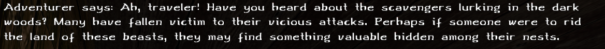
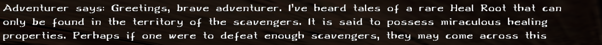
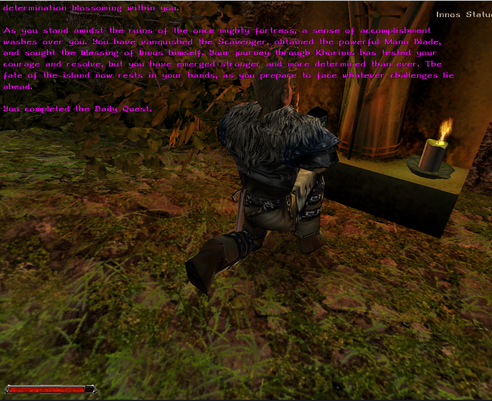

# llm-quest-generator

(more detailed documentation coming soon...)

Letting an LLM's generate quests is difficult. LLM's are statistical models that have no sophisticated representation of understanding and cannot connect these representations properly.
Thats most likely the reason, why they still cannot write good stories. Because good stories consist of interesting ideas that evolve in a logical way.

That's why we should try to go the other way around.
Create structures, evolve them and let the LLM's simply comment on the structure.

## How it looks in game...

A new feature is now available on the GMA-Server: Daily Quests that are generated by an LLM.

The idea is, that quests are often just structured as "Kill X" "Bring me Y" "Interact with Z".
We will generate the structure of the quest at random and then let the LLM create a story around that structure.

### How to find the quests.
GMA doesnt give explicit quests. But rather spread hint's via the ambient NPC's. Try to find "Adventurers" in Khorinis and talk to them.
They will give you dialogues hinting on what to do.
The Daily Quests require you to accomplish 3 TASKS!

#### There currently 3 types of Quests.

A) Kill X
That one is simple. E.g The ambient NPC will hint you on killing an Wolf. If you do so, you will have accomplish a task.
A message will inform you, that you accomplished a task.

B) Kill X until you find Y.
That one is simply an extension of A). For example youre supposed to kill a Wolf until it drops a Health Root. (50% drop chance)

C) Interact with X.
Here it's simply about triggering a Mob, like praying on the Innos shrine.

#### After you have accomplished 3 Tasks you have completed your Daily Quest.

